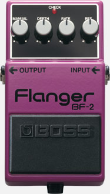

# BF-2 Style Flanger

A JUCE/CMake VST3 flanger inspired by the control layout and character of the Boss BF-2 pedal.

This is not an official Boss/Roland product or an exact circuit model. It is a compact digital flanger with manual delay, depth, rate, feedback/resonance, mix, and output controls.



## Build

Prerequisites:

- CMake 3.22+
- Visual Studio 2022 with the "Desktop development with C++" workload
- Internet access on the first configure so CMake can fetch JUCE

From this folder:

```powershell
cmake -S . -B build -G "Visual Studio 17 2022" -A x64
cmake --build build --config Release
```

The VST3 is copied after build to:

```text
build\BF2StyleFlanger_artefacts\Release\VST3\BF-2 Style Flanger.vst3
```

To use it in Ableton Live, copy the `.vst3` bundle to your VST3 folder:

```text
C:\Program Files\Common Files\VST3
```

That folder usually requires administrator permission. After copying, rescan plugins in Ableton Live.

## Controls

- Manual: base delay time, like moving the comb-filter center.
- Depth: modulation sweep width.
- Rate: LFO speed.
- Resonance: feedback amount for the sharper BF-2-style metallic peak.
- Mix: dry/wet blend.
- Output: final gain trim.
